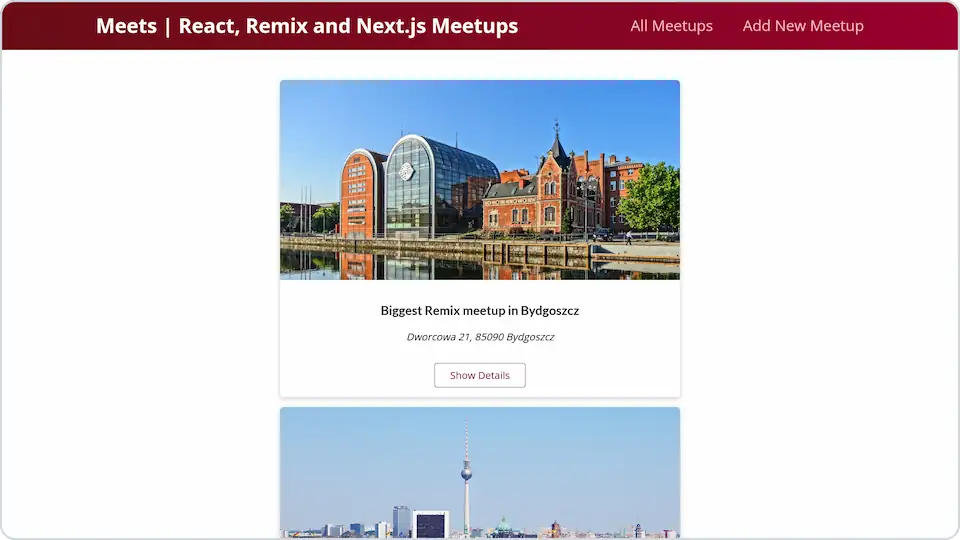

# 🏙️ Meets

**View and add JavaScript meetups in your city. A demo project with Next.js.**

## 💻 Screenshot

## 🛠️ Tools and technologies
`Next.js` `React` `CSS modules` `VS Code`

## 🌐 Deployment
Deployed on `Vercel`.

Live preview at [dawidlehai-meets.vercel.app](https://dawidlehai-meets.vercel.app/).

## 🎓 Related course
This project was created as a part of the [Udemy](https://www.udemy.com/ 'Udemy') course [_React - The Complete Guide (incl Hooks, React Router, Redux)_](https://www.udemy.com/course/react-the-complete-guide-incl-redux/ 'See this course on Udemy') by [Maximilian Schwarzmüller](https://twitter.com/maxedapps 'Maximilian Schwarzmüller on Twitter').

By preparing this project I learned basics about **Next.js**.
